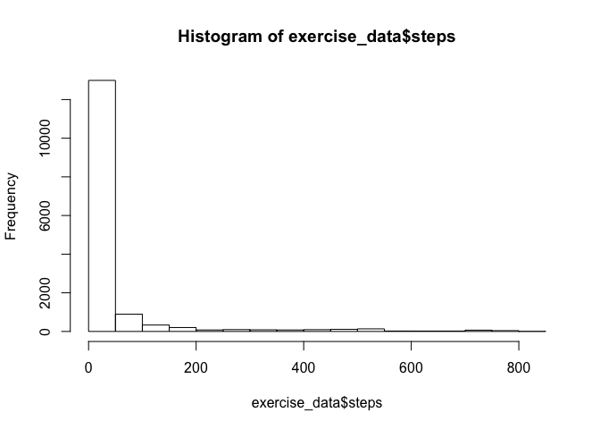
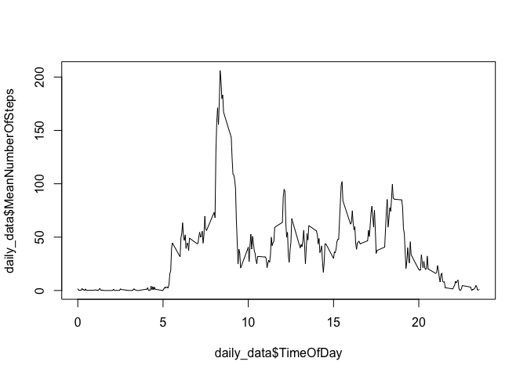
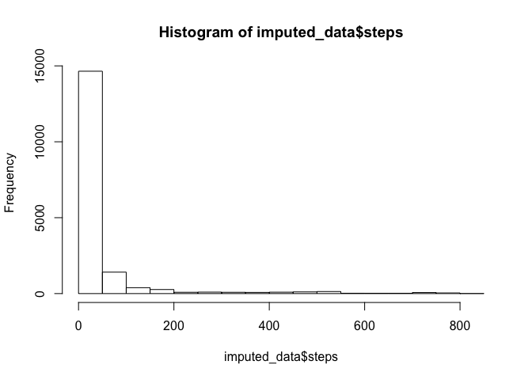
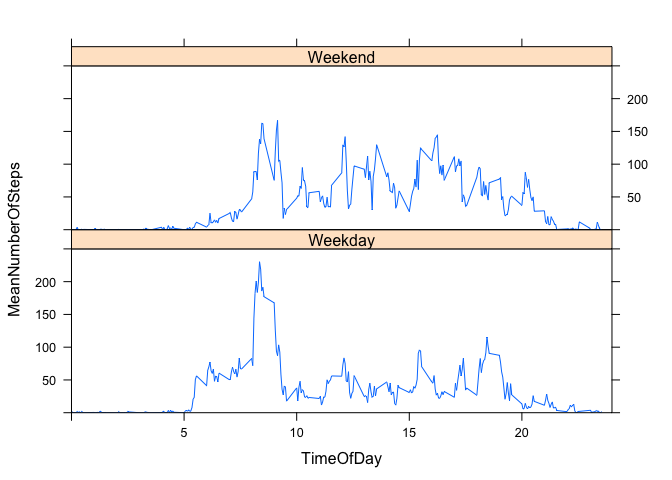

# Reproducible Research: Peer Assessment 1


## Loading and preprocessing the data

I download the zip file, being sure to add method="curl" to account for Macs, then unzip it in my working directory.  I've already tried downloading it on my own computer, which is how I know what the name of the file will be.


```r
library(utils)
download.file("https://d396qusza40orc.cloudfront.net/repdata%2Fdata%2Factivity.zip", "mydata.zip", method="curl")
unzip("mydata.zip")
# I read the file to create an R object.  I don't want factors.  This will allow my second column to be easily made a date field.
exercise_data<-read.csv("activity.csv", stringsAsFactors = FALSE)
exercise_data$date=as.Date(exercise_data$date)
```
 
Let's look at our data!


```r
head(exercise_data)
```

```
##   steps       date interval
## 1    NA 2012-10-01        0
## 2    NA 2012-10-01        5
## 3    NA 2012-10-01       10
## 4    NA 2012-10-01       15
## 5    NA 2012-10-01       20
## 6    NA 2012-10-01       25
```

```r
tail(exercise_data)
```

```
##       steps       date interval
## 17563    NA 2012-11-30     2330
## 17564    NA 2012-11-30     2335
## 17565    NA 2012-11-30     2340
## 17566    NA 2012-11-30     2345
## 17567    NA 2012-11-30     2350
## 17568    NA 2012-11-30     2355
```

It's a bit misleading that our time intervals are integers. Let's make them decimals, at least.  We'll divide the timeslot by 100, and force it to show to 2 decimal places, so that 2310 (11:10 pm) will be 23.10.  Maybe not perfect, but much better.


```r
exercise_data$interval<-format(round(exercise_data$interval / 100, 2), nsmall = 2)
head(exercise_data)
```

```
##   steps       date interval
## 1    NA 2012-10-01     0.00
## 2    NA 2012-10-01     0.05
## 3    NA 2012-10-01     0.10
## 4    NA 2012-10-01     0.15
## 5    NA 2012-10-01     0.20
## 6    NA 2012-10-01     0.25
```

```r
tail(exercise_data)
```

```
##       steps       date interval
## 17563    NA 2012-11-30    23.30
## 17564    NA 2012-11-30    23.35
## 17565    NA 2012-11-30    23.40
## 17566    NA 2012-11-30    23.45
## 17567    NA 2012-11-30    23.50
## 17568    NA 2012-11-30    23.55
```


## What is mean total number of steps taken per day?

I'll use mean first, keeping in mind that I'll need to remove NA values first.

```r
mean(exercise_data$steps, na.rm=TRUE)
```

```
## [1] 37.3826
```

The mean number of steps is 37.3826.

Now we can do the same with median:

```r
median(exercise_data$steps, na.rm=TRUE)
```

```
## [1] 0
```

The median step count is 0 (not a lot of walking happening!).

We can confirm this odd finding with a histogram, which shows a sharply asymmetrical distribution with an overwhelming majority of values at or near 0:


```r
hist(exercise_data$steps)
```



## What is the average daily activity pattern?

We want to find out what time of day exercise is happening.  We'll do that by taking each 5-minute slice of the day and averaging the number of steps taken in that slice, then plotting it with a line graph.  Aggregate comes in handy here!  We'll also rename the columns.


```r
daily_data<-aggregate(x=exercise_data$steps, by=list(exercise_data$interval), FUN=mean, na.rm=TRUE)
colnames(daily_data)<-c("TimeOfDay", "MeanNumberOfSteps")
head(daily_data)
```

```
##   TimeOfDay MeanNumberOfSteps
## 1      0.00         1.7169811
## 2      0.05         0.3396226
## 3      0.10         0.1320755
## 4      0.15         0.1509434
## 5      0.20         0.0754717
## 6      0.25         2.0943396
```

```r
tail(daily_data)
```

```
##     TimeOfDay MeanNumberOfSteps
## 283     23.30         2.6037736
## 284     23.35         4.6981132
## 285     23.40         3.3018868
## 286     23.45         0.6415094
## 287     23.50         0.2264151
## 288     23.55         1.0754717
```

Now that we've aggregated our data, let's plot it!


```r
plot(daily_data$TimeOfDay, daily_data$MeanNumberOfSteps, type="l")
```



Find the time of day with the max mean number of steps:


```r
daily_data$TimeOfDay[which(daily_data$MeanNumberOfSteps == max(daily_data$MeanNumberOfSteps) )]
```

```
## [1] " 8.35"
```

Looks like 8:35 am is our big time!  Folks headed out to work and school, I bet.

## Imputing missing values

We have many missing data points in our original dataset.  How many?


```r
summary(exercise_data$steps)
```

```
##    Min. 1st Qu.  Median    Mean 3rd Qu.    Max.    NA's 
##    0.00    0.00    0.00   37.38   12.00  806.00    2304
```

2304 NA's.  

Let's assume that these missing data points probably would have reflected average (mean) behavior for that same time of day.  We'll replace any steps that are NA with the average for that same time of day.

First, we'll copy over the complete records to a new data frame.


```r
complete_data<-exercise_data[(which(complete.cases(exercise_data))),]
head(complete_data)
```

```
##     steps       date interval
## 289     0 2012-10-02     0.00
## 290     0 2012-10-02     0.05
## 291     0 2012-10-02     0.10
## 292     0 2012-10-02     0.15
## 293     0 2012-10-02     0.20
## 294     0 2012-10-02     0.25
```

Now we'll take the incomplete records (the ones with missing step counts), and merge just the interval and date columns with daily_data, which will put the number of steps back in -- but this time it'll be the mean steps for that time of day.


```r
imputed_data<-merge(x = exercise_data[!complete.cases(exercise_data),2:3], y = daily_data, by.x = "interval", by.y="TimeOfDay")
head(imputed_data)
```

```
##   interval       date MeanNumberOfSteps
## 1     0.00 2012-10-01          1.716981
## 2     0.00 2012-11-30          1.716981
## 3     0.00 2012-11-04          1.716981
## 4     0.00 2012-11-09          1.716981
## 5     0.00 2012-11-14          1.716981
## 6     0.00 2012-11-10          1.716981
```

Now let's row bind these columns.  We'll want to rename the third column of imputed data so that it's no longer "Mean Number of Steps" before we bind.


```r
names(imputed_data)[3]<-"steps"
imputed_data<-rbind(imputed_data, complete_data)
head(imputed_data)
```

```
##   interval       date    steps
## 1     0.00 2012-10-01 1.716981
## 2     0.00 2012-11-30 1.716981
## 3     0.00 2012-11-04 1.716981
## 4     0.00 2012-11-09 1.716981
## 5     0.00 2012-11-14 1.716981
## 6     0.00 2012-11-10 1.716981
```

Let's compare the histogram, mean, and median of this dataset with what I found with the original dataset!


```r
mean(imputed_data$steps, na.rm=TRUE)
```

```
## [1] 37.3826
```

```r
median(imputed_data$steps, na.rm=TRUE)
```

```
## [1] 0
```

```r
hist(imputed_data$steps)
```



Unsurprisingly, there's no difference, because I filled in missing values with means, so they should not affect the means!

## Are there differences in activity patterns between weekdays and weekends?

Let's create a new column that reads either "weekday" or "weekend".  Dplyr will come in handy here for its %in% function.


```r
library(dplyr)
```

```
## 
## Attaching package: 'dplyr'
```

```
## The following objects are masked from 'package:stats':
## 
##     filter, lag
```

```
## The following objects are masked from 'package:base':
## 
##     intersect, setdiff, setequal, union
```

```r
imputed_data$day_type[weekdays(imputed_data$date) %in% c("Saturday", "Sunday")] = "Weekend"
imputed_data$day_type[!weekdays(imputed_data$date) %in% c("Saturday", "Sunday")] = "Weekday"
head(imputed_data)
```

```
##   interval       date    steps day_type
## 1     0.00 2012-10-01 1.716981  Weekday
## 2     0.00 2012-11-30 1.716981  Weekday
## 3     0.00 2012-11-04 1.716981  Weekend
## 4     0.00 2012-11-09 1.716981  Weekday
## 5     0.00 2012-11-14 1.716981  Weekday
## 6     0.00 2012-11-10 1.716981  Weekend
```

Now, let's get some aggregation happening again!


```r
wd_we_data<-aggregate(x=imputed_data$steps, by=list(imputed_data$day_type, imputed_data$interval), FUN=mean, na.rm=TRUE)
colnames(wd_we_data)<-c("DayType", "TimeOfDay", "MeanNumberOfSteps")
head(wd_we_data)
```

```
##   DayType TimeOfDay MeanNumberOfSteps
## 1 Weekday      0.00        2.25115304
## 2 Weekend      0.00        0.21462264
## 3 Weekday      0.05        0.44528302
## 4 Weekend      0.05        0.04245283
## 5 Weekday      0.10        0.17316562
## 6 Weekend      0.10        0.01650943
```

```r
tail(wd_we_data)
```

```
##     DayType TimeOfDay MeanNumberOfSteps
## 571 Weekday     23.45        0.26331237
## 572 Weekend     23.45        1.70518868
## 573 Weekday     23.50        0.29685535
## 574 Weekend     23.50        0.02830189
## 575 Weekday     23.55        1.41006289
## 576 Weekend     23.55        0.13443396
```


Let's load the lattice package so we can see some easy side-by-side plots to show the weekday/weekend pattern.


```r
library(lattice)
```

After a bit of tweaking with the various arguments, we are able to plot the activity pattern differences using xyplot:


```r
xyplot(MeanNumberOfSteps ~ TimeOfDay | as.factor(DayType), data=wd_we_data, layout =c(1,2), type = "l", ylim=c(0,250), xlim=c(0,24))
```



It seems, from the graph, that weekend activity is more spread out over the day than weekday activity, which spikes at morning and evening "rush hour".
